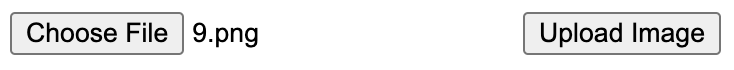

# Images classifier

Using a pre-trained image classifier of CNN to identify images. You can upload the images through the local web interface and the classifier will identify the image.

## Installation

```bash
python3 -m pip install -r requirements.txt
```

## Train the model

```bash
cd ./models
python3 training.py
```

This model would be trained with the MNIST dataset. The Convolutional Neural Network (CNN) is built from scratch using the Keras library with the following layers:

| Layer                | Output Shape     |
|----------------------|------------------|
| **Input**            | (28, 28, 1)       |
| **Conv2D** (64 filters, 3x3) | (26, 26, 64)       |
| **MaxPooling2D** (2x2)       | (13, 13, 64)       |
| **Conv2D** (64 filters, 3x3) | (11, 11, 64)       |
| **MaxPooling2D** (2x2)       | (5, 5, 64)         |
| **Conv2D** (64 filters, 3x3) | (3, 3, 64)         |
| **Flatten**                   | (576)              |
| **Dense** (64 neurons)         | (64)               |
| **Dropout** (50%)              | (64)               |
| **Output** (Dense, 10 neurons) | (10)               |

<!-- - Total Parameters: $64 * (3*3*1) + 64 + 64 * (3*3*64) + 64 + 64 * (3*3*64) + 64 + 576 * 64 + 64 + 64 * 10 + 10$
112,074 -->

- Total Parameters: $112,074$

The model will be saved as `model.h5` in the `models` directory.

## Run the Web interface

After training the model, you can run the web interface by running the following command:

```bash
python app.py
```

The web interface will be running on `http://localhost:5001/`. You can upload the image and the classifier will identify the image based on the trained model.

## Demo

In this demo, you can upload the image of number 9 like below:


And upload the image to the web interface:



The model will identify the image as number 9.


